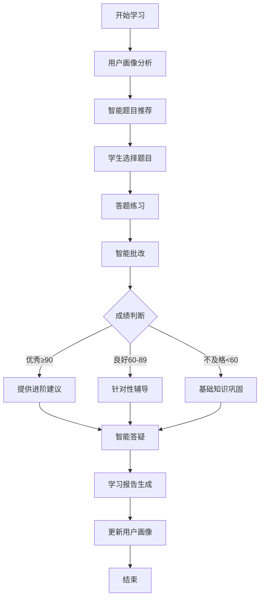

## 一、项目概述

### 1.1 研究背景
随着人工智能技术的快速发展，智能教育成为教育领域的重要发展方向。传统教育模式存在个性化不足、反馈不及时、资源分配不均等问题。本项目旨在构建一个基于RAG（Retrieval-Augmented Generation）技术的智能教育Agent系统，实现个性化学习辅导、智能批改和知识问答功能。

### 1.2 系统目标
- **个性化学习**：根据学生水平和学习历史，智能推荐适合的题目
- **智能批改**：自动批改学生答案，提供详细反馈和解析
- **知识问答**：基于知识库的智能答疑系统
- **学习追踪**：记录学习轨迹，分析薄弱环节，提供改进建议

### 1.3 技术架构
```
┌─────────────────────────────────────────────────────────┐
│                     用户交互层（CLI）                      │
├─────────────────────────────────────────────────────────┤
│                     业务逻辑层                            │
│  ┌──────────┐ ┌──────────┐ ┌──────────┐ ┌──────────┐  │
│  │学习流程  │ │智能批改  │ │题目推荐  │ │答疑系统  │  │
│  │管理器    │ │  引擎    │ │  引擎    │ │         │  │
│  └──────────┘ └──────────┘ └──────────┘ └──────────┘  │
├─────────────────────────────────────────────────────────┤
│                      RAG技术层                           │
│  ┌──────────────┐        ┌───────────────────────────┐ │
│  │ 向量数据库    │        │    LLM调用层（OpenAI）     │ │
│  │ (Embeddings) │◄──────►│  - GPT-3.5/4              │ │
│  └──────────────┘        │  - text-embedding-ada-002 │ │
│                          └───────────────────────────┘ │
├─────────────────────────────────────────────────────────┤
│                     数据持久层                            │
│  ┌────────────────────────────────────────────────────┐ │
│  │              SQLite数据库                           │ │
│  │  users | answer_records | mistakes | knowledge     │ │
│  └────────────────────────────────────────────────────┘ │
└─────────────────────────────────────────────────────────┘
```

## 二、RAG技术选型与实现

### 2.1 RAG技术选型理由

#### 2.1.1 为什么选择RAG架构
**传统方案的局限性**：
- **纯规则系统**：灵活性差，难以处理复杂的自然语言
- **纯LLM方案**：容易产生幻觉，缺乏领域知识的准确性
- **传统检索**：无法理解语义，检索精度有限

**RAG架构的优势**：
1. **知识增强**：通过检索相关知识，增强LLM的回答准确性
2. **可解释性**：可以追溯答案来源，提高系统可信度
3. **动态更新**：知识库可以独立更新，无需重新训练模型
4. **成本效益**：减少对大模型的依赖，降低推理成本

#### 2.1.2 技术栈选择
| 组件 | 选择 | 理由 |
|------|------|------|
| **嵌入模型** | text-embedding-ada-002 | 性价比高，中文支持良好，向量维度适中(1536) |
| **向量存储** | 自实现SimpleVectorDB | 轻量级，满足教育场景需求，便于定制化 |
| **LLM** | GPT-3.5-turbo | 成本和效果平衡，支持中文，响应速度快 |
| **相似度算法** | 余弦相似度 | 计算简单高效，适合文本语义匹配 |
| **数据库** | SQLite | 轻量级，无需额外部署，适合单机应用 |

### 2.2 RAG实现细节

#### 2.2.1 向量数据库实现
```python
class SimpleVectorDB:
    """
    核心设计思路：
    1. 内存缓存 + 文件持久化
    2. 内容去重（MD5哈希）
    3. 延迟计算嵌入向量
    """
    
    def __init__(self, persist_dir: str):
        self.vectors = {}      # 向量存储
        self.metadata = {}     # 元数据存储
        self.index = {}        # 内容索引（哈希->文档ID）
```

**关键特性**：
- **内容去重**：使用MD5哈希避免重复存储相同内容
- **延迟加载**：嵌入向量按需计算，减少初始化时间
- **持久化**：JSON格式存储，便于调试和迁移

#### 2.2.2 知识检索流程
```python
def similarity_search(self, query: str, k: int = 3):
    """
    检索流程：
    1. 查询向量化：query → embedding
    2. 相似度计算：余弦相似度
    3. 结果排序：按相似度降序
    4. 返回Top-K
    """
    # 获取查询向量
    query_embedding = get_embedding(query)
    
    # 计算相似度
    for doc_id, doc_embedding in self.vectors.items():
        similarity = cosine_similarity(query_embedding, doc_embedding)
        
    # 返回最相似的K个结果
    return top_k_results
```

**优化策略**：
1. **向量缓存**：避免重复计算相同文档的嵌入
2. **批处理**：支持批量向量化，减少API调用
3. **索引优化**：使用哈希索引加速查找

#### 2.2.3 知识增强生成
```python
def grade_answer_with_rag(self, question, answer):
    """
    RAG增强的批改流程：
    1. 检索相关知识点
    2. 构建增强提示词
    3. 调用LLM生成批改结果
    """
    # Step 1: 检索相关知识
    knowledge = vector_db.similarity_search(question, k=3)
    
    # Step 2: 构建增强的Prompt
    augmented_prompt = f"""
    相关知识点：{knowledge}
    题目：{question}
    学生答案：{answer}
    请基于相关知识点进行批改...
    """
    
    # Step 3: LLM生成
    result = llm.generate(augmented_prompt)
    return parse_result(result)
```

### 2.3 知识库构建

#### 2.3.1 知识来源
1. **预定义知识点**：数学基础概念、定理、公式
2. **题目库**：典型例题及解答
3. **错题积累**：学生历史错题及解析
4. **动态扩展**：教师可添加新知识点

#### 2.3.2 知识表示
```json
{
    "point_name": "勾股定理",
    "subject": "数学",
    "description": "直角三角形两条直角边的平方和等于斜边的平方",
    "examples": "a²+b²=c²",
    "difficulty": "简单",
    "embedding": [0.1, 0.2, ...],  // 1536维向量
    "metadata": {
        "grade": "初中",
        "chapter": "几何"
    }
}
```

## 三、系统执行流程

### 3.1 完整学习流程



### 3.2 核心流程详述

#### 3.2.1 题目推荐流程
```python
def recommend_questions(user_id):
    """
    推荐算法：
    1. 获取用户画像（水平、历史、错题）
    2. 分析薄弱知识点
    3. 匹配合适难度的题目
    4. 返回个性化推荐列表
    """
    # 用户画像
    profile = get_user_profile(user_id)
    level = profile['level']  # 初级/中级/高级
    
    # 错题分析
    mistakes = get_user_mistakes(user_id)
    weak_points = analyze_weak_points(mistakes)
    
    # 难度映射
    difficulty_map = {
        '初级': '简单',
        '中级': '中等', 
        '高级': '困难'
    }
    
    # 生成推荐
    questions = generate_questions(
        difficulty=difficulty_map[level],
        weak_points=weak_points,
        count=5
    )
    
    return questions
```

**推荐策略**：
- **适应性难度**：根据用户水平调整题目难度
- **薄弱点强化**：优先推荐薄弱知识点相关题目
- **循序渐进**：遵循学习曲线，逐步提升难度

#### 3.2.2 智能批改流程
```python
def grade_answer(question, user_answer):
    """
    批改流程：
    1. RAG检索相关知识
    2. 构建批改提示词
    3. LLM智能批改
    4. 结构化输出
    5. 保存批改记录
    """
    
    # Step 1: 知识检索
    relevant_knowledge = retrieve_knowledge(question)
    
    # Step 2: 批改提示词构建
    grading_prompt = build_grading_prompt(
        question=question,
        answer=user_answer,
        knowledge=relevant_knowledge,
        rubric=get_grading_rubric()
    )
    
    # Step 3: LLM批改
    raw_result = llm.complete(grading_prompt)
    
    # Step 4: 结果解析
    grading_result = parse_grading_result(raw_result)
    
    # Step 5: 数据持久化
    save_grading_record(grading_result)
    
    return grading_result
```

**批改维度**：
1. **答案正确性**（40%）：核心内容是否正确
2. **解题过程**（30%）：步骤是否完整、逻辑是否清晰
3. **知识运用**（20%）：相关知识点的应用
4. **表达规范**（10%）：数学符号、术语使用

#### 3.2.3 答疑解惑流程
```python
def qa_session(context):
    """
    答疑流程：
    1. 基于批改结果的上下文初始化
    2. 多轮对话管理
    3. 知识库增强回答
    4. 对话历史记录
    """
    
    # 初始化对话上下文
    messages = [
        {"role": "system", "content": build_qa_context(context)},
        {"role": "assistant", "content": initial_guidance}
    ]
    
    while user_question := get_user_input():
        # RAG增强
        relevant_info = search_knowledge(user_question)
        
        # 构建增强的问题
        augmented_question = enhance_with_knowledge(
            user_question, 
            relevant_info
        )
        
        # 生成回答
        response = llm.chat(messages + [
            {"role": "user", "content": augmented_question}
        ])
        
        # 更新对话历史
        messages.extend([
            {"role": "user", "content": user_question},
            {"role": "assistant", "content": response}
        ])
        
        # 保存对话
        save_qa_history(user_question, response)
```

### 3.3 数据流转

#### 3.3.1 用户学习数据流
```
用户输入 → 题目推荐 → 答题 → 批改 → 答疑
    ↓         ↓        ↓      ↓       ↓
 用户画像  推荐记录  答案记录 批改结果 对话历史
    ↓         ↓        ↓      ↓       ↓
    └─────────┴────────┴──────┴───────┘
                    ↓
              SQLite数据库持久化
                    ↓
            学习报告 & 用户画像更新
```

#### 3.3.2 知识数据流
```
知识点定义 → 文本向量化 → 向量存储
     ↓           ↓           ↓
 知识元数据   Embedding    VectorDB
     ↓           ↓           ↓
     └───────────┴───────────┘
              ↓
         检索 & 匹配
              ↓
      RAG增强的AI回答
```

## 四、关键技术实现

### 4.1 用户画像系统

```python
class UserProfile:
    """
    用户画像维度：
    - 知识水平：初级/中级/高级
    - 学习风格：视觉型/听觉型/实践型
    - 薄弱环节：基于错题分析
    - 学习进度：已掌握/学习中/未学习
    """
    
    def update_profile(self, answer_record):
        # 动态更新用户水平
        self.update_level(answer_record.score)
        
        # 更新知识图谱
        self.update_knowledge_map(answer_record.knowledge_points)
        
        # 分析学习模式
        self.analyze_learning_pattern(answer_record)
```

### 4.2 错题智能分析

```python
def analyze_mistakes(mistakes):
    """
    错题分析维度：
    1. 知识点分布：哪些知识点错误率高
    2. 错误类型：概念错误/计算错误/理解偏差
    3. 难度分布：各难度等级的正确率
    4. 时间规律：什么时间段错误率高
    """
    
    analysis = {
        'knowledge_distribution': {},
        'error_types': {},
        'difficulty_accuracy': {},
        'time_patterns': {}
    }
    
    for mistake in mistakes:
        # 知识点统计
        for point in mistake['knowledge_points']:
            analysis['knowledge_distribution'][point] += 1
            
        # 错误类型分类
        error_type = classify_error(mistake)
        analysis['error_types'][error_type] += 1
        
    return analysis
```

### 4.3 学习路径规划

```python
def plan_learning_path(user_profile, target):
    """
    学习路径规划算法：
    1. 评估当前水平
    2. 确定目标差距
    3. 生成阶段性目标
    4. 推荐学习资源
    """
    
    current_level = assess_current_level(user_profile)
    gap_analysis = analyze_gap(current_level, target)
    
    learning_path = []
    for knowledge_point in gap_analysis:
        stage = {
            'knowledge': knowledge_point,
            'difficulty': get_appropriate_difficulty(user_profile),
            'exercises': recommend_exercises(knowledge_point),
            'estimated_time': estimate_learning_time(knowledge_point)
        }
        learning_path.append(stage)
    
    return optimize_path(learning_path)
```
## 五、系统展示
### 5.1 运行方式

可以使用python agent.py运行，也可以使用release中提供的exe文件运行

### 5.2 运行截图


